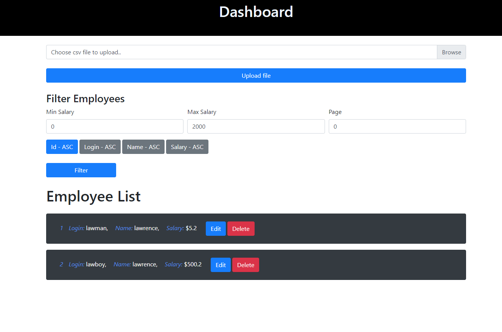
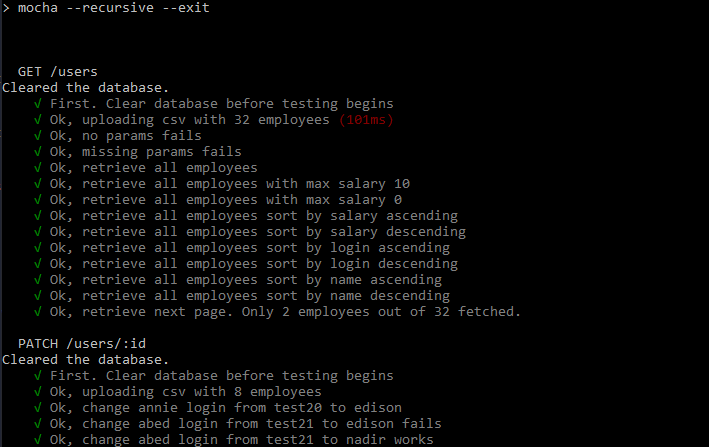

# Take home assignment from GovTech

I have attempted user stories 1, 2 and 3.

This application is built with the MERN stack - MongoDB, ExpressJS, ReactJS and NodeJS.

I chose to use the ReactJS libary because I wanted to create a dashboard that is very responsive and shows results of user in real time without having
to refresh the page. Note that Hooks and Redux was not used.

I'm more familiar with Express so I used that to set up the server side logic.

Given another chance, I might go with PostgreSQL. MongoDB does not have good support for transactions, which on hindsight, feels like a better approach.

The CSS is done very simply with Bootstrap. If given more time, I would have attempted to use my own css stylings with SASS.

# To install and setup
Make sure the machine has mongodb and node installed.

After cloning the project, you can install the node packages for the server side with `npm install` from the src directory. Then run `npm run client-install` from the src directory to install the node packages for the client side.

To run the application, use `npm run dev`, which will concurrently run both the server side and client side servers at the same time. The client side has a proxy set to route to server side.

More info on the scripts can be seen in the `package.json` file.

The dashboard should look like this:

# Project Structure
The main files are `./server.js` (Main file for server side) and `./client/src/App.js` (Main file for client side). 

# Testing
To run the tests, run the command `npm run test` which will run a mocha command to recursively set off the unit tests in the `./test/api/employees` folder.

The unit testing is done with `chai`, `supertest` and `mocha`. Efforts were made to incorporate `mockgoose` but I believe the version of mongodb that I have might be incompatible.

The outcome should look like this:

